# Next.js System Monitor Dashboard 🚀

A modern, high-performance, real-time system monitoring dashboard built with **Next.js 14+**, **Material UI**, and **Node.js**. Specifically optimized for Linux servers and professional Linux server environments to provide a beautiful, responsive interface for tracking system resources, Docker containers, and processes.

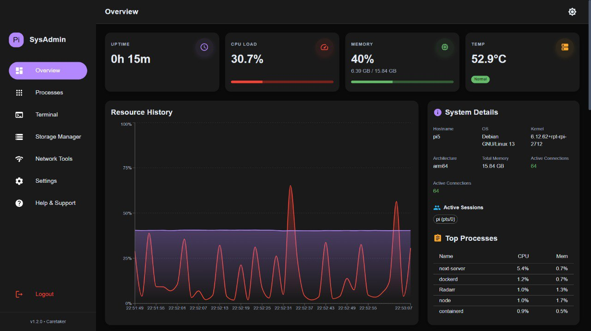

## ✨ New & Updated Features

- **🎨 Modernized Auth UI**: Sleek glassmorphism login interface with improved validation, backdrop blur effects, and responsive design.
- **🔐 Secure Session Management**: Integrated **Logout** functionality and persistent "Remember Me" support via JWT.
- **⚡ Linux Performance Optimization**: 
  - **Standalone Build Mode**: Uses Next.js standalone output to reduce the production footprint from **2GB to ~96MB**.
  - **RAM Disk Friendly**: Designed to run efficiently in volatile high-speed storage environments.
- **📊 Real-Time Monitoring**: Live tracking of CPU usage, Memory pressure, Temperature, and Network I/O.
- **🐳 Container & Process Management**: 
  - Full Docker integration (Start/Stop/Logs/Stats).
  - Advanced Process Manager with termination capabilities.
- **🛠️ Integrated Tools**: Built-in Network tools (Ping/DNS), Storage Manager (File browser/editor), and a secure Command Runner.

## 🚀 Core Features

- **Authentication**: Secure login using SSH credentials, with a fallback for environment variables.
- **Docker Integration**: 
  - View running/stopped containers.
  - Real-time CPU & Memory usage per container.
  - **Live Logs** viewer for containers.
  - Start/Stop status indicators.
- **Process Manager**: Top 5 CPU consumers on dashboard + dedicated full process list.
- **Visual History**: Interactive area graphs for CPU and Memory history.
- **Storage Manager**: Browse the file system, view mounted filesystems with usage, and edit text files directly in the browser.
- **Responsive Design**: Fully optimized for Mobile, Tablet, and Desktop.
- **Dark/Light Mode**: Toggleable themes saved to local storage.

## 🛠️ Tech Stack

- **Framework**: [Next.js 14+](https://nextjs.org/) (App Router & Turbopack)
- **UI Library**: [Material UI (MUI)](https://mui.com/)
- **Charts**: [Recharts](https://recharts.org/)
- **System Info**: [systeminformation](https://www.npmjs.com/package/systeminformation)
- **Backend**: Node.js API Routes (Next.js)

## 🐳 Docker Deployment (Recommended)

The easiest way to run the dashboard with all necessary permissions is using Docker Compose.

1.  **Build and Start**
    ```bash
    docker compose up -d --build
    ```

2.  **Required Permissions**
    To ensure the dashboard can read system metrics from the host, the container requires:
    - Access to the **Docker Socket** (`/var/run/docker.sock`)
    - Access to host system paths (`/proc`, `/sys`)
    - `privileged: true` or specific capabilities for hardware temperature/CPU data.

## 📦 Manual Installation (Production Mode)

1.  **Clone & Install**
    ```bash
    git clone https://github.com/CrimsonDevil333333/Nextjs-system-monitor-dashboard.git
    cd Nextjs-system-monitor-dashboard
    npm install
    ```

2.  **Build Optimized Standalone**
    ```bash
    npm run build
    ```

3.  **Run Production Server**
    ```bash
    PORT=9123 node .next/standalone/server.js
    ```

## 📱 Screenshots

### Dark Mode (Professional)
| Dashboard Overview | Docker Management |
|---|---|
|  |  |

| Live Logs | Process Manager |
|---|---|
| 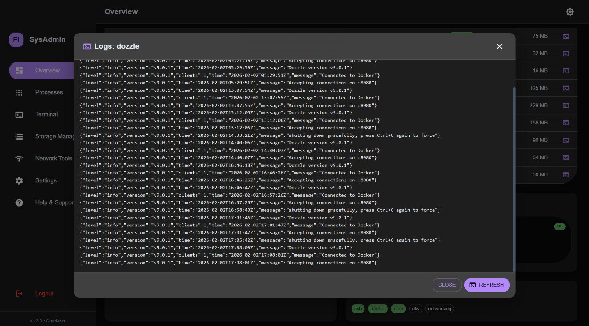 | 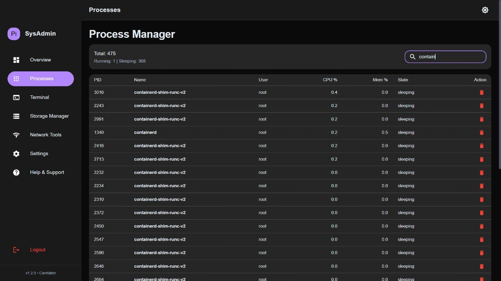 |

| Storage Manager | Network Tools |
|---|---|
| 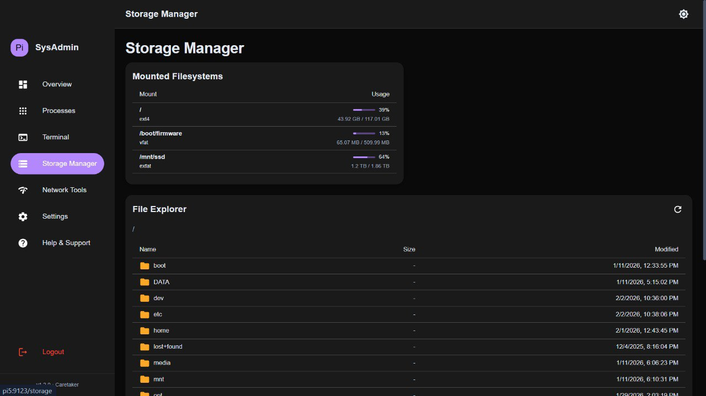 | 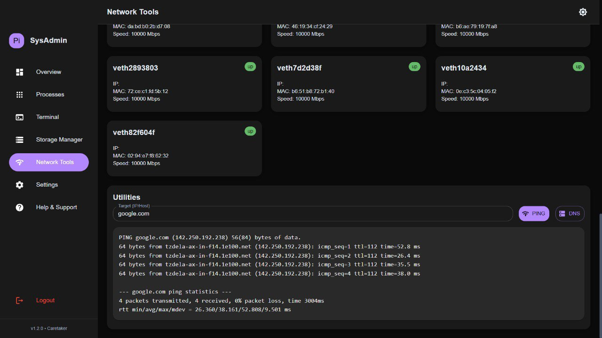 |

| Command Runner | Login Interface |
|---|---|
| 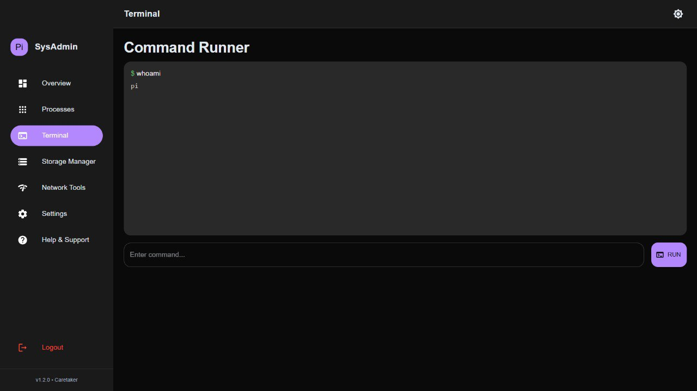 | 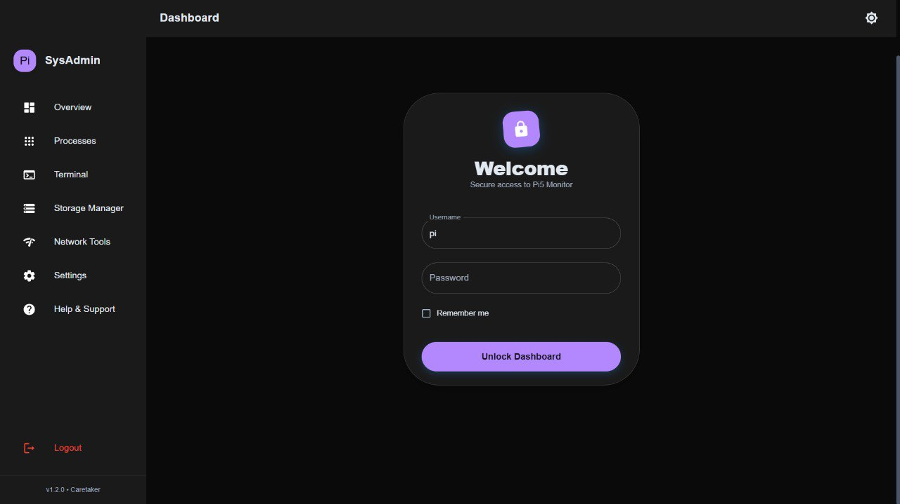 |

### Light Mode (Clean)
| Dashboard Overview | Process Manager |
|---|---|
| 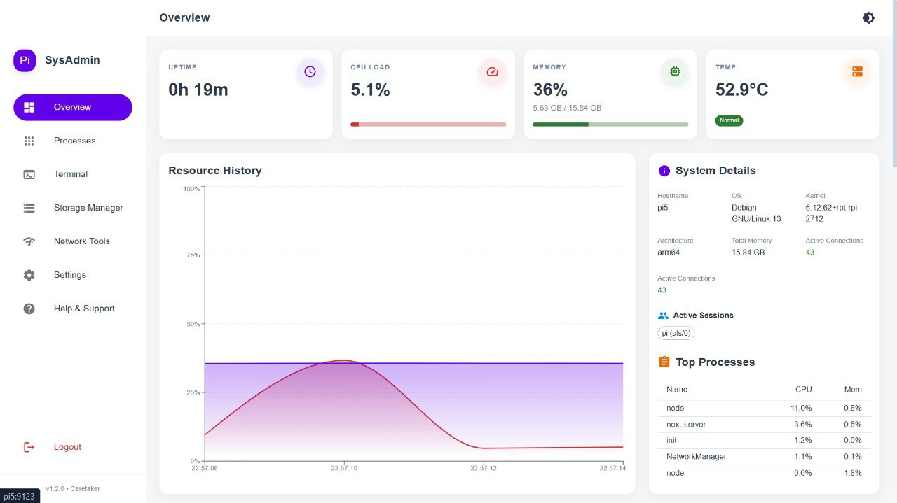 | 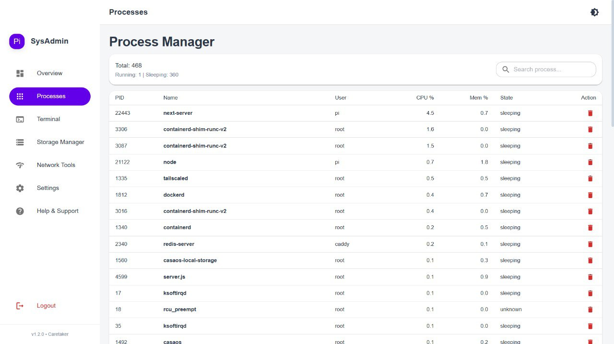 |

| Command Runner | Storage Manager |
|---|---|
| 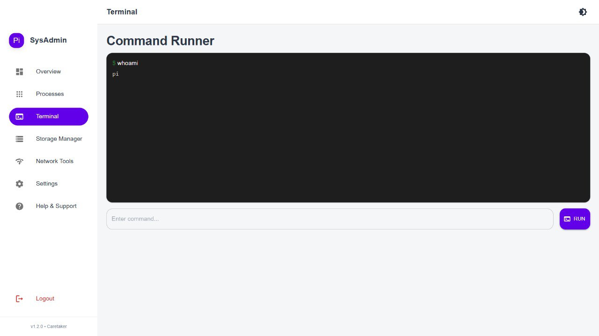 | 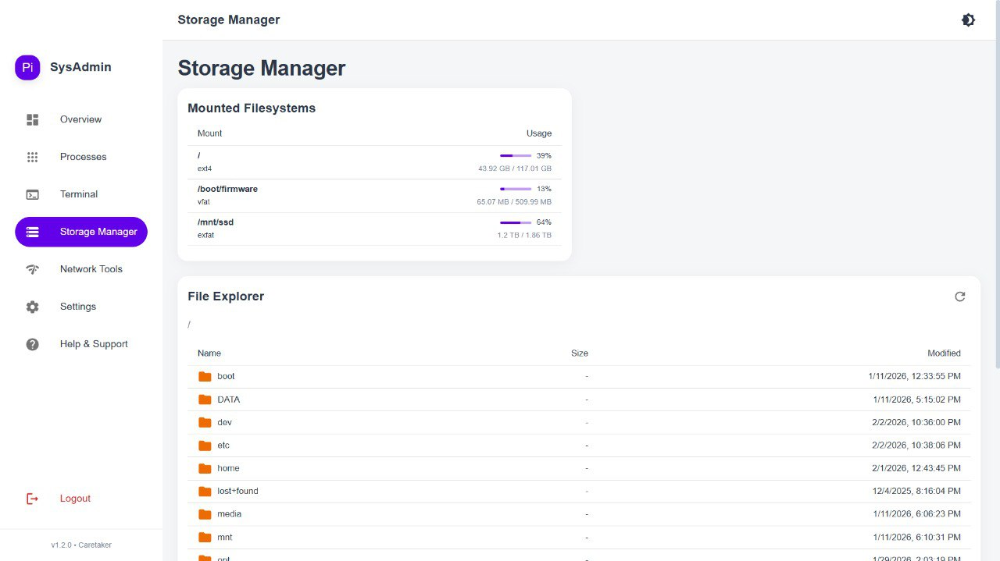 |

| Network Tools | Login Interface |
|---|---|
| 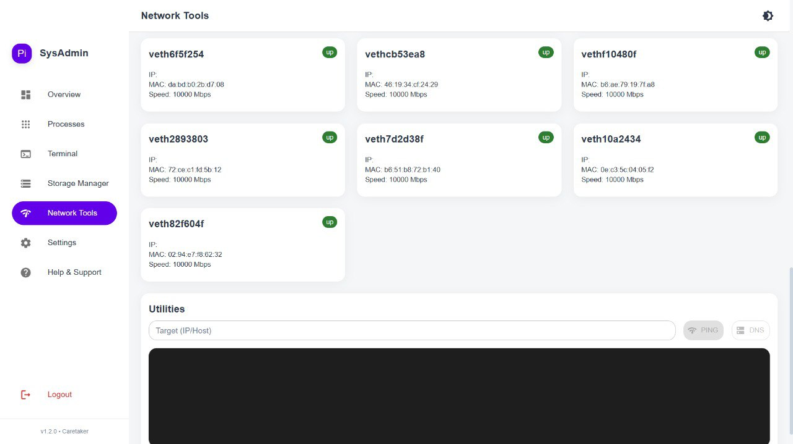 | 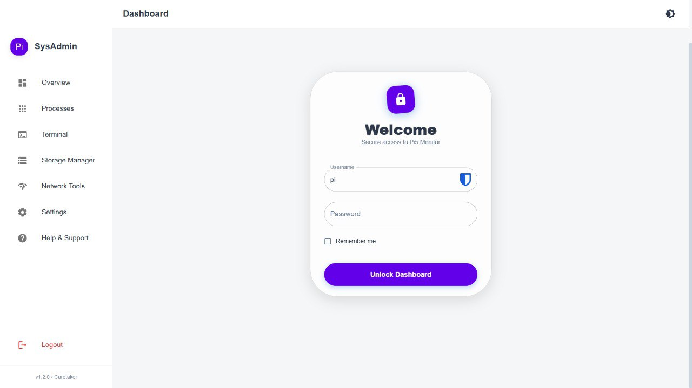 |

## 🤝 Contributing

This project is actively maintained. Contributions, issue reports, and feature requests are welcome!

---
*Maintained by Satyaa & Clawdy 🦞*
