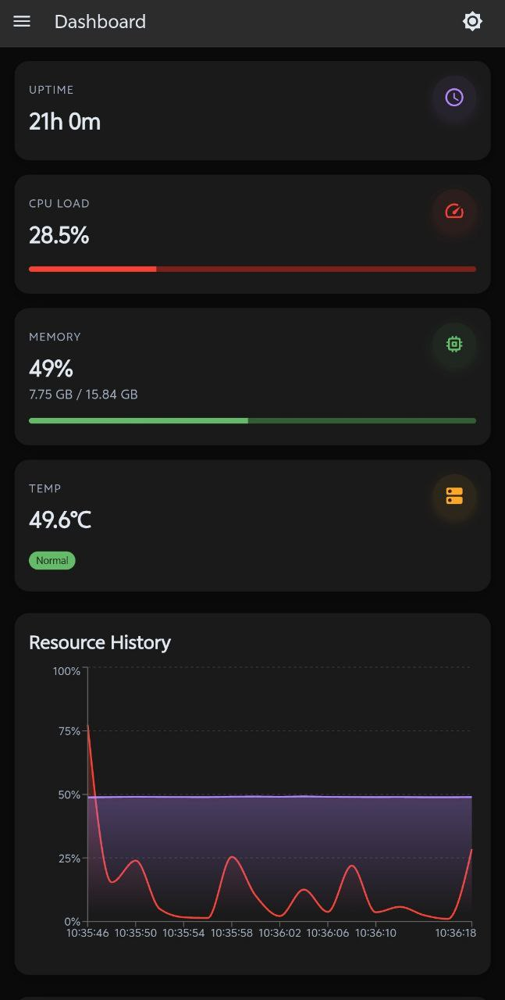

# Next.js System Monitor Dashboard

A modern, real-time system monitoring dashboard built with **Next.js**, **Material UI**, and **Node.js**. Optimized for Raspberry Pi 5.



## 🚀 Features

- **Optimized Auth UI**: Glassmorphism login card with better error handling.
- **Standalone Mode**: Build footprint reduced from 2GB to ~96MB.
- **Logout Support**: Dedicated session termination in the sidebar.
- **Dynamic Headers**: Real-time page title updates in the navigation bar.
- **System Monitoring**: Live tracking of CPU, Memory, Temp, and Network.
- **Docker & Process Manager**: Control containers and processes directly.

## 🛠️ Performance (Pi5 Optimized)

This project uses Next.js Standalone output to minimize RAM and storage usage on professional servers.

## 📦 Installation & Deployment

1.  **Build**
    ```bash
    npm run build
    ```

2.  **Production Run**
    ```bash
    PORT=9123 node .next/standalone/server.js
    ```

---
*Created by Satyaa & Clawdy 🦞*
