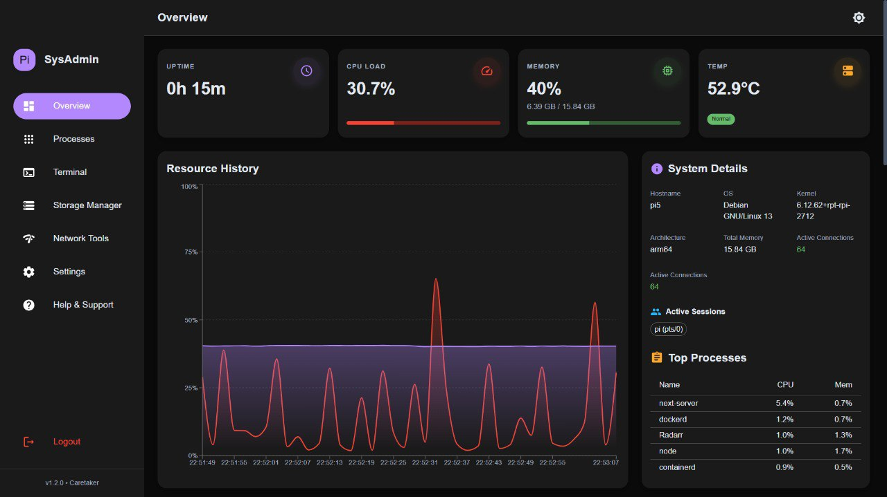

# 🔴 Linux System Monitor Dashboard

A **modern, production-grade** real-time system monitoring dashboard built with **Next.js 16**, **Material UI 7**, and **Node.js**. Designed to work seamlessly on any Linux distribution - from Raspberry Pi to Ubuntu servers.




---

## ⭐ Features

### 📊 Real-Time Monitoring
- **Live CPU Usage** - Percentage and historical chart
- **Memory Tracking** - Active, total, and percentage
- **Temperature Monitoring** - CPU temperature with warnings
- **Network I/O** - Upload/download speeds per interface
- **Uptime Tracking** - System running time
- **WebSocket Updates** - 2-second refresh rate

### 🐳 Docker Management
- List all containers (running/stopped)
- View container stats (CPU, Memory, Network I/O, Block I/O)
- Start, Stop, Restart, Pause, Unpause containers
- View container logs (last 200 lines)
- Docker images management (list, pull, remove)

### 📈 Process Manager
- Full process list with search and sorting
- View PID, Name, CPU%, Memory%, User
- **Kill processes** with confirmation

### 💾 Storage Manager
- Browse filesystem directories
- View disk usage per mount point
- Edit text files directly in browser
- Download files

### 🌐 Network Tools
- View all network interfaces and status
- Active connections count
- **Ping** - Test connectivity to hosts
- **DNS Lookup** - Resolve domain names

### ⏰ Cron Manager
- List current user's crontab
- Add new cron jobs
- Edit existing jobs
- Delete cron jobs

### 🖥️ Terminal
- Execute shell commands securely
- Quick command shortcuts (top, free, df, docker ps, etc.)
- Command history with arrow keys
- Rate limiting (12 requests/minute)
- Dangerous command blocking

### 📦 Packages (Debian/Ubuntu)
- List upgradable packages
- List installed packages
- Install/Remove packages
- Upgrade all packages

### ⚙️ Services (Systemd)
- List all systemd services
- View service status (active/inactive)
- Start, Stop, Restart services
- Enable/Disable services
- View service logs (journalctl)

### 📜 Logs
- System logs (journalctl)
- Kernel logs (dmesg)
- Configurable line count

### 📈 Historical Data
- SQLite-backed metrics storage
- Time ranges: 1h, 6h, 24h, 7 days
- CPU and memory history charts
- Data aggregation for performance

### 🔐 Authentication
- Uses **system credentials** (same as SSH login)
- Support for both `sudo` and `su` verification
- JWT-based session management
- Rate limiting on login attempts
- Token blacklisting on logout

### 🎨 UI/UX
- **Dark/Light Mode** - Toggle anytime
- Responsive design (mobile-friendly)
- Loading skeletons
- Error handling with user feedback
- Modern Material UI 7 components
- Recharts for data visualization

---

## 🚀 Quick Start

### Prerequisites
- Node.js 20+ 
- npm or yarn
- A Linux system (Ubuntu, Debian, Raspberry Pi OS, CentOS, etc.)

### Installation

```bash
# Clone the repository
git clone https://github.com/CrimsonDevil333333/Nextjs-system-monitor-dashboard.git
cd Nextjs-system-monitor-dashboard

# Install dependencies
npm install
```

### Run Development Server

```bash
npm run dev

# Access at http://localhost:3000
```

### Login Credentials
Use your **Linux system username and password** (same as SSH login).

---

## 🏭 Production Deployment

### Build and Run

```bash
# Build the application
npm run build

# Run the production server
PORT=3000 JWT_SECRET=$(openssl rand -hex 32) node .next/standalone/server.js
```

### Using Docker

```bash
# Build and start the container
docker compose up -d --build

# Access at http://localhost:3000
```

### Using Docker (Manual)

```bash
# Build the image
docker build -t sys-monitor .

# Run the container
docker run -d \
  --name sys-monitor \
  -p 3000:3000 \
  -e JWT_SECRET=your-secret-here \
  -v /var/run/docker.sock:/var/run/docker.sock:ro \
  -v /proc:/host/proc:ro \
  -v /sys:/host/sys:ro \
  -v /etc:/host/etc:ro \
  --privileged \
  sys-monitor
```

---

## 🔧 Environment Variables

| Variable | Description | Default |
|----------|-------------|---------|
| `PORT` | Server port | `3000` |
| `HOSTNAME` | Server hostname | `localhost` |
| `JWT_SECRET` | **REQUIRED in production** - JWT signing secret | Auto-generated (insecure) |
| `DEV_AUTH` | Development auth `username:password` | Disabled |
| `VERIFY_SCRIPT` | Password verification script | `./verify_su.sh` |
| `DB_PATH` | SQLite database path | `./data/metrics.db` |
| `DEFAULT_HOME` | Default home directory for terminal | System HOME |
| `METRICS_INTERVAL_MS` | Metrics collection interval | `30000` (30s) |
| `HISTORY_RETENTION_DAYS` | How long to keep historical data | `7` |

### Generating JWT Secret

```bash
# Generate a secure random secret
openssl rand -hex 32
```

---

## 🔐 Authentication

### How It Works
1. Enter your Linux username (e.g., `pi`, `admin`, `ubuntu`)
2. Enter your Linux password
3. The dashboard uses `sudo` (or `su`) to verify your credentials

### Permissions Setup

The verification script needs root access:

```bash
# Make sure verify_su.sh is executable
chmod +x verify_su.sh

# The script uses sudo by default, so ensure your user has sudo access
sudo visudo
# Add: username ALL=(ALL) NOPASSWD: /path/to/verify_su.sh
```

### Quick Dev Mode (No Password Verification)

For testing or development without password setup:

```bash
DEV_AUTH=admin:password123 npm run dev
```

---

## 📱 Menu Items

| Page | Description |
|------|-------------|
| **Overview** | Dashboard with CPU, Memory, Temp, Network, Storage charts |
| **Processes** | Full process list with search, sort, and kill capability |
| **Docker** | Container management with stats, logs, and actions |
| **Terminal** | Secure command execution with quick shortcuts |
| **Cron** | Cron job management (view, add, edit, delete) |
| **Packages** | APT package management (Debian/Ubuntu) |
| **Services** | Systemd service management with logs |
| **Storage** | Filesystem browser with file editing |
| **Network** | Interface status, ping, and DNS lookup |
| **Logs** | System logs viewer (journalctl, dmesg) |
| **Settings** | Theme toggle and preferences |
| **Help** | Documentation and shortcuts |

---

## 🛠️ Tech Stack

| Technology | Purpose |
|------------|---------|
| **Next.js 16** | React framework with App Router |
| **Material UI 7** | Component library |
| **Recharts** | Data visualization charts |
| **systeminformation** | Cross-platform system info |
| **better-sqlite3** | SQLite database |
| **ws** | WebSocket server |
| **jose** | JWT authentication |
| **tsx** | TypeScript execution |

---

## 🖥️ Supported Systems

- ✅ Raspberry Pi OS
- ✅ Ubuntu (all versions)
- ✅ Debian
- ✅ CentOS/RHEL
- ✅ Fedora
- ✅ Any Linux distribution with **glibc**

### System Requirements
- Linux kernel 3.0+
- Node.js 20+
- ~100MB disk space
- ~50MB RAM

---

## ⚠️ Troubleshooting

### "JWT_SECRET not configured" Warning
This is expected in development. In production, always set it:
```bash
export JWT_SECRET=$(openssl rand -hex 32)
```

### Docker Access Denied
Ensure Docker socket is mounted correctly in container:
```yaml
volumes:
  - /var/run/docker.sock:/var/run/docker.sock:ro
```

### Password Verification Fails
1. Check that verify_su.sh is executable: `chmod +x verify_su.sh`
2. Ensure user has sudo privileges
3. Try DEV_AUTH for testing: `DEV_AUTH=myuser:mypass npm run dev`

### Port Already in Use
```bash
# Find and kill process using port 3000
lsof -i :3000
kill -9 <PID>

# Or use different port
PORT=3001 npm run dev
```

### Metrics Not Collecting
- Check that `/proc` and `/sys` are accessible
- Run with elevated privileges if needed

---

## 📁 Project Structure

```
.
├── src/
│   ├── app/                 # Next.js App Router pages
│   │   ├── api/            # API routes
│   │   ├── page.tsx        # Dashboard
│   │   ├── processes/      # Process manager
│   │   ├── docker/         # Docker management
│   │   ├── terminal/       # Terminal page
│   │   └── ...             # Other pages
│   ├── components/         # React components
│   └── lib/               # Utility libraries
│       ├── auth.ts        # Authentication
│       ├── database.ts    # SQLite operations
│       ├── metrics-collector.ts
│       └── websocket.ts   # WebSocket server
├── public/                 # Static assets
├── data/                  # SQLite database
├── verify_su.sh          # Password verification script
├── server.ts             # Custom server entry
├── package.json
├── Dockerfile
└── docker-compose.yml
```

---

## 🤝 Contributing

Contributions are welcome! Please feel free to submit a Pull Request.

---

## 📄 License

**MIT License** - See [LICENSE](LICENSE) file for details.

---

## 👨‍💻 Author

**CrimsonDevil333333**
- GitHub: [@CrimsonDevil333333](https://github.com/CrimsonDevil333333)

---

## 🙏 Acknowledgments

- [systeminformation](https://github.com/sebhildebrandt/systeminformation) - System info library
- [Material UI](https://mui.com/) - UI components
- [Next.js](https://nextjs.org/) - React framework